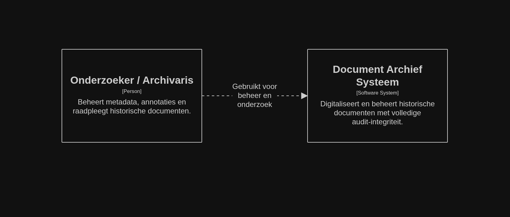
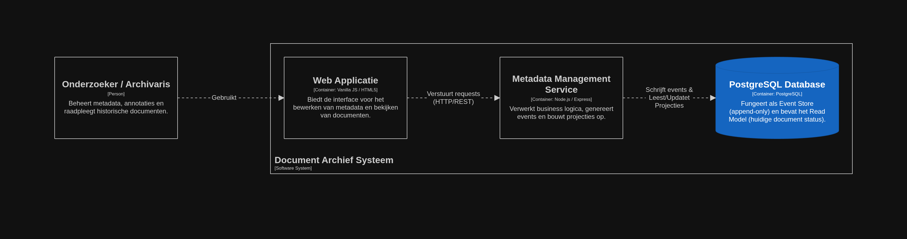
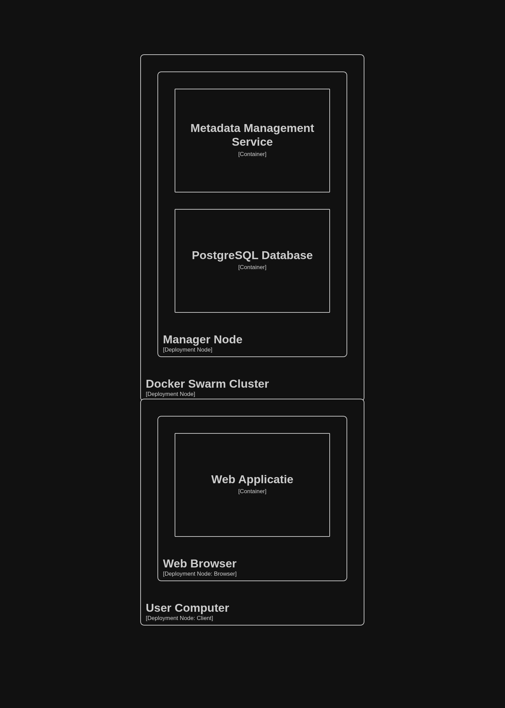

# ICT Architecture - Document Archief Systeem (Geconsolideerde Documentatie)

Dit document bevat de volledige architecturale documentatie van het Document Archief Systeem, inclusief de gedetailleerde Architecture Decision Records (ADR's) en de bijbehorende C4-modellen.

---

## 1. Project Overview

Dit project implementeert een **Document Archief Systeem** voor het digitaliseren en beheren van historische documenten. Het systeem richt zich specifiek op onderzoekers en archivarissen die metadata bewerken, documenten raadplegen en annotaties toevoegen. De kernwaarde van het systeem is de onschendbaarheid van de historische data.

---

## 2. Architecture Decision Records

### ADR-004: Aanpak voor Data-integriteit en Versioning

**Status:** Accepted  
**Datum:** 7 mei 2026

#### 2.1 Context
Historische documenten zijn onvervangbaar en kritisch. Binnen ons systeem moeten we te allen tijde vermijden dat data per ongeluk overschreven of verwijderd wordt ("geen dataverlies"). Tegelijk vereisen onderzoekers en archivarissen een volledige audit trail (wie heeft wat wanneer aangepast) en de mogelijkheid tot versioning van zowel metadata als annotaties.

In **ADR-002** (Gescheiden Opslagstrategie) is reeds de keuze gemaakt om een relationele database (PostgreSQL) in te zetten voor de verwerking van metadata. Om de data-integriteit binnen deze component te waarborgen zonder de complexiteit van de technologie-stack onnodig te vergroten, hebben we een strategie nodig voor de manier waarop we data opslaan.

#### 2.2 Decision
We kiezen ervoor om het **Event Sourcing (Append-Only Log) patroon** toe te passen binnen PostgreSQL voor het beheer van de metadata en document-wijzigingen.

In plaats van tabellen destructief aan te passen (`UPDATE` of `DELETE`), wordt elke wijziging in de levenscyclus van een document (bijv. `DocumentCreated`, `MetadataUpdated`, `AnnotationAdded`) opgeslagen als een onveranderlijk (immutable) nieuw "event" in een append-only tabel.

#### 2.3 Considered options

**1. Klassieke CRUD (Create, Read, Update, Delete) met Audit Table**  
Elke wijziging past de hoofd-tabel aan, en een database-trigger schrijft de oude staat naar een aparte `audit_log` tabel.
*   **Voordelen:** Eenvoudig op te zetten; queries voor de huidige staat zijn zeer performant.
*   **Nadelen:** Data overschrijving op de hoofdtabel riskeert dataverlies; audit logs zijn vaak geen 'source of truth'.

**2. Event Sourcing met PostgreSQL (Append-Only) - *Gekozen***  
Alle wijzigingen worden als een reeks acties in de tijd opgeslagen in één `events` tabel. De huidige staat (de "projectie") wordt berekend door de events op volgorde af te spelen.
*   **Voordelen:** 100% data-integriteit; events zijn *immutable*; out-of-the-box audit log en perfecte versioning; gebruikt bestaande PostgreSQL technologie.
*   **Nadelen:** Bevragen van huidige staat vereist complexere code (Projection Engine).

**3. Dedicated Event Store (bijv. EventStoreDB of Kafka)**  
Specifieke databases ontworpen voor Event Sourcing.
*   **Voordelen:** Afgestemd op extreem hoge writes en event-streams.
*   **Nadelen:** Introduceert een nieuwe technologie en operationele overhead; niet gerechtvaardigd voor metadata volume.

#### 2.4 Rationale
De onvervangbaarheid van historische documenten (Data-integriteit) weegt het zwaarst. Het Event Sourcing patroon geeft de garantie dat we elke tussenstap van een document (van eerste upload, door de OCR, tot de correcties van de archivaris) exact kunnen herleiden. Omdat we reeds gekozen hebben voor PostgreSQL, kunnen we gebruik maken van diens krachtige `JSONB` ondersteuning om variërende payloads van events flexibel op te slaan.

#### 2.5 Consequences
*   **Positief:** Strikte databeveiliging en integriteit; volledig inzicht in de levensloop van documenten; naadloze integratie met bestaande Node.js/PostgreSQL stack.
*   **Negatief:** Complexiteit bij het bevragen van data; noodzaak voor een gesynchroniseerd Read-model (CQRS), wat kan zorgen voor 'eventual consistency' in de UI.

---

## 3. C4 Architecturale Diagrammen

Hieronder staan de drie gevraagde C4-modellen in Structurizr DSL formaat, die de implementatie van bovenstaande beslissingen visualiseren.

### 3.1 Systeemcontextdiagram
Toont de interactie tussen de Onderzoeker/Archivaris en het Document Archief Systeem in de bredere context.



```structurizr
workspace "Document Archief" "Systeemcontext" {
    model {
        user = person "Onderzoeker / Archivaris" "Beheert metadata, annotaties en raadpleegt historische documenten."
        system = softwareSystem "Document Archief Systeem" "Digitaliseert en beheert historische documenten met volledige audit-integriteit."

        user -> system "Gebruikt voor beheer en onderzoek"
    }

    views {
        systemContext system "SystemContext" {
            include *
            autoLayout
        }
    }
}
```

### 3.2 Containerdiagram
Toont de technische bouwblokken en de interactie tussen de Metadata Service en de Event Store.



```structurizr
workspace "Document Archief" "Container Diagram" {
    model {
        user = person "Onderzoeker / Archivaris" "Beheert metadata, annotaties en raadpleegt historische documenten."
        
        system = softwareSystem "Document Archief Systeem" {
            webApp = container "Web Applicatie" "Biedt de interface voor het bewerken van metadata en bekijken van documenten." "Vanilla JS / HTML5"
            metadataService = container "Metadata Management Service" "Verwerkt business logica, genereert events en bouwt projecties op." "Node.js / Express"
            database = container "PostgreSQL Database" "Fungeert als Event Store (append-only) en bevat het Read Model (huidige document status)." "PostgreSQL" "Database"
        }

        user -> webApp "Gebruikt"
        webApp -> metadataService "Verstuurt requests (HTTP/REST)"
        metadataService -> database "Schrijft events & Leest/Updatet Projecties"
    }

    views {
        container system "Containers" {
            include *
            autoLayout
        }

        styles {
            element "Database" {
                shape Cylinder
                background #1565C0
                color #ffffff
            }
        }
    }
}
```


### 3.3 Deployment Diagram
Visualiseert de distributie van de containers over de Docker Swarm cluster (3 managers, 2 workers).



```structurizr
workspace "Document Archief" "Deployment Diagram" {
    model {
        system = softwareSystem "Document Archief Systeem" {
            webApp = container "Web Applicatie"
            metadataService = container "Metadata Management Service"
            database = container "PostgreSQL Database"
        }

        deploymentEnvironment "Productie / Test Cluster" {
            deploymentNode "User Computer" "Windows / macOS / Linux" "Client" {
                deploymentNode "Web Browser" "Chrome / Firefox / Edge" "Browser" {
                    containerInstance webApp
                }
            }

            deploymentNode "Docker Swarm Cluster" "Debian Linux" {
                deploymentNode "Manager Node" "Control & Compute plane" {
                    containerInstance metadataService
                    containerInstance database
                }
            }
        }
    }

    views {
        deployment system "Productie / Test Cluster" "Deployment" {
            include *
            autoLayout
        }

        styles {
            element "Client" {
                background #999999
            }
            element "Browser" {
                background #ffffff
            }
        }
    }
}
```

---

## 4. Project Structuur

De fysieke organisatie van het project is als volgt:

```
03_opdracht/
├── ADR-004-Data-Integriteit-en-Versioning.md  # Gedetailleerde ADR (los bestand)
├── README.md                                  # Hoofddocumentatie (overzicht)
├── Architectuur-Documentatie-Compleet.md      # Geconsolideerde versie (dit bestand)
├── poc_data_integrity/                        # Proof of Concept implementatie
│   ├── server.js                              # Node.js backend met Event Sourcing logica
│   ├── init.sql                               # Database schema voor de Event Store
│   ├── poc.yaml                               # Docker stack definitie
│   └── public/index.html                      # Frontend interface voor de POC
├── Container_Event_Sourcing-dark.png          # Visualisatie van de architectuur
└── les/                                       # Lesmateriaal en achtergrondinformatie
```

---

## 5. Proof of Concept

Er is een werkende Proof of Concept beschikbaar in de directory `poc_data_integrity/`. Deze POC demonstreert de praktische werking van het Event Sourcing patroon met PostgreSQL:
- Elke wijziging resulteert in een nieuw event (`INSERT`).
- Verwijderingen zijn logisch en behouden de volledige geschiedenis.
- De huidige staat van een document wordt real-time geprojecteerd vanuit de event-stream.

Zie de `README.md` in de POC-folder voor specifieke instructies over het draaien van de stack in een Docker Swarm omgeving.
