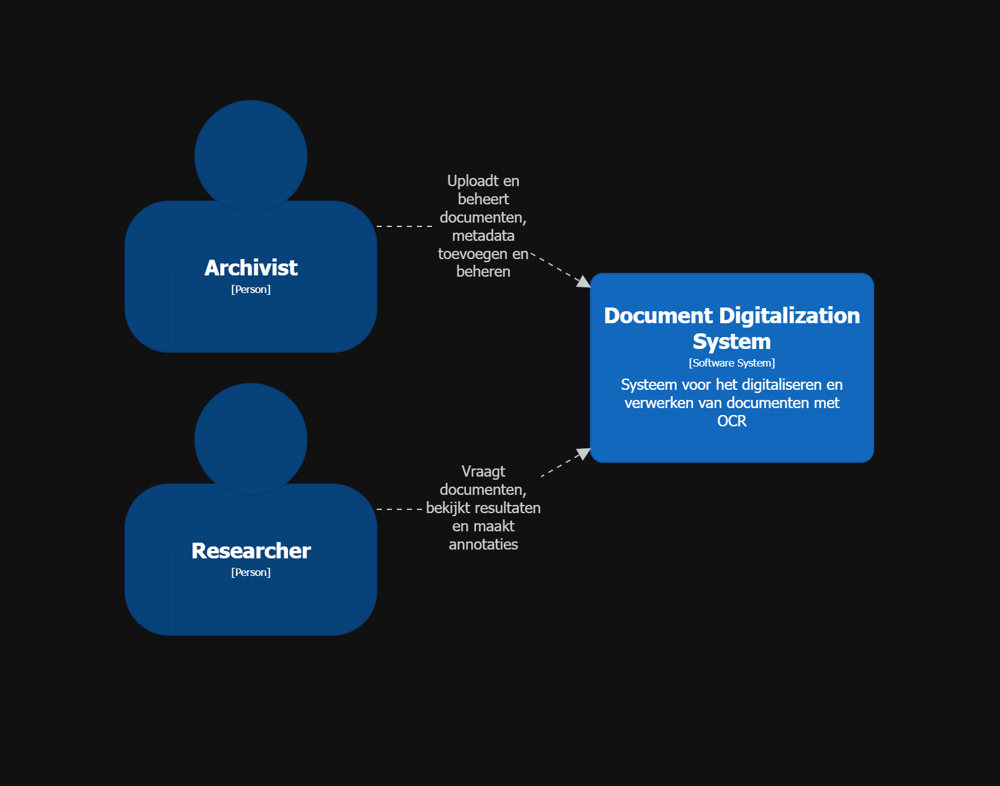
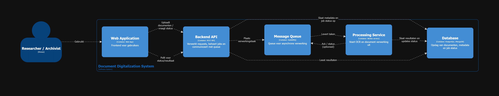
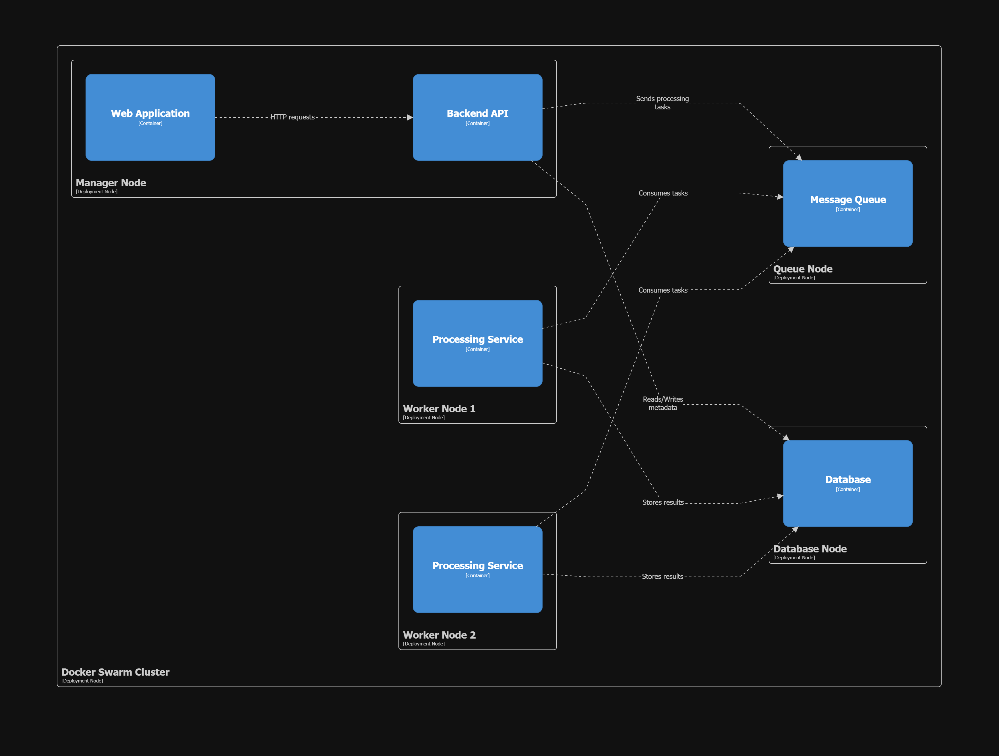

# ADR-001: Gebruik van een Message Queue voor ontkoppeling van upload en verwerking

**Status:** Accepted  
**Datum:** 04/05/2026

---

## Context

De applicatie moet grote hoeveelheden historische documenten verwerken.  
Een belangrijk onderdeel van de workflow is het uitvoeren van OCR op geüploade documenten. Deze verwerking is computationeel intensief en kan aanzienlijk meer tijd in beslag nemen dan het uploaden zelf.

Een van de belangrijkste architecturale karakteristieken is:

- **Scalability**: het systeem moet grote hoeveelheden documenten kunnen verwerken en flexibel kunnen schalen afhankelijk van de belasting.

Zonder extra maatregelen zou een synchrone verwerking (waarbij OCR direct na upload gebeurt) leiden tot:

- Lange wachttijden voor gebruikers  
- Slechte gebruikerservaring  
- Beperkte schaalbaarheid

---

## Decision

We kiezen ervoor om een **Message Queue** te gebruiken om uploads los te koppelen van de OCR-verwerking.

Concreet wordt **RabbitMQ** gebruikt als message broker om berichten (taken) in een wachtrij te plaatsen, die vervolgens asynchroon verwerkt worden door aparte processing componenten.

---

## Considered options

### 1. Synchrone verwerking

Uploads worden onmiddellijk verwerkt door de OCR-component.

**Voordelen:**
- Eenvoudige implementatie  
- Geen extra infrastructuur nodig  

**Nadelen:**
- Slechte schaalbaarheid  
- Lange responstijden  
- Sterke koppeling tussen upload en verwerking  

---

### 2. Asynchrone verwerking zonder message queue

Bijvoorbeeld via directe service-aanroepen of polling.

**Voordelen:**
- Minder infrastructuur dan een volwaardige message queue  
- Enige vorm van ontkoppeling mogelijk  

**Nadelen:**
- Minder robuust bij piekbelasting  
- Moeilijker beheer van retries en foutafhandeling  
- Beperkte buffering van taken  

---

### 3. Asynchrone verwerking met message queue (gekozen)

Gebruik van een message broker om taken in wachtrijen te plaatsen.

**Voordelen:**
- Sterke ontkoppeling tussen componenten  
- Betere schaalbaarheid door buffering van taken  
- Ondersteuning voor retries en foutafhandeling  
- Mogelijkheid tot parallelle verwerking  

**Nadelen:**
- Extra operationele complexiteit  
- Nood aan beheer van de message broker  

---

## Rationale

De keuze voor een message queue wordt voornamelijk gedreven door de vereiste **scalability**.

- OCR-verwerking is resource-intensief en moet onafhankelijk kunnen schalen van het uploadproces  
- Door taken in een wachtrij te plaatsen, kunnen meerdere processing workers parallel werken  
- Het systeem kan piekbelasting opvangen door taken tijdelijk te bufferen  

Daarnaast draagt deze aanpak bij aan:

- **Loose coupling** tussen ingestion en processing componenten  
- Betere fouttolerantie via retries en queue-mechanismen  
- Flexibiliteit om later andere verwerkingsstappen toe te voegen  

---

## Consequences

**Positief:**
- Verbeterde schaalbaarheid van verwerking  
- Betere gebruikerservaring (snelle uploads, verwerking op de achtergrond)  
- Mogelijkheid tot horizontale schaalvergroting van processing componenten  

**Negatief:**
- Complexere architectuur  
- Nood aan monitoring van queues en workers  
- Eventuele vertraging tussen upload en beschikbaarheid van resultaten  

---

## Notes

De keuze voor RabbitMQ is een implementatiedetail dat deze architecturale beslissing ondersteunt.  
De kern van de beslissing is het gebruik van een message queue als patroon, onafhankelijk van de specifieke technologie.

---

## C4-Model

De architectuur is vastgelegd in Structurizr DSL. De bronbestanden staan in [c4-model/](c4-model/).

### Systeemcontextdiagram



```structurizr
workspace {

    model {
        researcher = person "Researcher"
        archivist = person "Archivist"


        system = softwareSystem "Document Digitalization System" {
            description "Systeem voor het digitaliseren en verwerken van documenten met OCR"
        }

        archivist -> system "Uploadt en beheert documenten, metadata toevoegen en beheren"
        researcher -> system "Vraagt documenten, bekijkt resultaten en maakt annotaties"
    }

    views {
        systemContext system {
            include *
            autolayout lr
        }

        theme default
    }
}
```

### Containerdiagram



```structurizr
workspace {

    model {
        user = person "Researcher / Archivist"

        system = softwareSystem "Document Digitalization System" {

            webapp = container "Web Application" {
                description "Frontend voor gebruikers"
                technology "Web App"
            }

            api = container "Backend API" {
                description "Verwerkt requests, beheert jobs en communiceert met queue"
                technology "REST API"
            }

            queue = container "Message Queue" {
                description "Queue voor asynchrone verwerking"
                technology "RabbitMQ"
            }

            processing = container "Processing Service" {
                description "Voert OCR en document verwerking uit"
                technology "Worker service"
            }

            db = container "Database" {
                description "Opslag van documenten, metadata en job status"
                technology "PostgreSQL / MongoDB"
            }
        }

        user -> webapp "Gebruikt"

        webapp -> api "Uploadt documenten / vraagt status"

        api -> db "Slaat metadata en job status op"
        api -> queue "Plaats verwerkingstaak"

        queue -> processing "Levert taken"
        processing -> queue "Ack / status (optioneel)"

        processing -> db "Slaat resultaten en updates status"

        webapp -> api "Pollt voor status/resultaat"
        api -> db "Leest resultaten"
    }

    views {
        container system {
            include *
            autolayout lr
        }

        theme default
    }
}
```

### Deploymentdiagram



```structurizr
workspace {

    model {
        system = softwareSystem "Document Digitalization System" {

            webapp = container "Web Application"
            api = container "Backend API"
            queue = container "Message Queue"
            processing = container "Processing Service"
            db = container "Database"

            // Relaties (essentieel voor layout)
            webapp -> api "HTTP requests"
            api -> queue "Sends processing tasks"
            processing -> queue "Consumes tasks"
            processing -> db "Stores results"
            api -> db "Reads/Writes metadata"
        }

        deploymentEnvironment "Production" {

            deploymentNode "Docker Swarm Cluster" {

                deploymentNode "Manager Node" {
                    containerInstance webapp
                    containerInstance api
                }

                deploymentNode "Worker Node 1" {
                    containerInstance processing
                }

                deploymentNode "Worker Node 2" {
                    containerInstance processing
                }

                deploymentNode "Queue Node" {
                    containerInstance queue
                }

                deploymentNode "Database Node" {
                    containerInstance db
                }
            }
        }
    }

    views {
        deployment system "Production" {
            include *
            autolayout lr 300 200
        }

        theme default
    }
}
```

---

## POC

Alle instructies voor opstarten, testen en stoppen staan in [poc/README.md](poc/README.md).