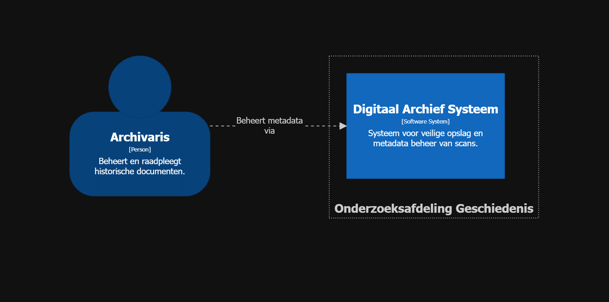

# Metadata Management en Object Storage

## Projectbeschrijving

Dit project is een Proof of Concept (POC) voor de ICT Architecture projectopdracht. Het toont hoe metadata en fysieke bestanden (blobs) gescheiden kunnen worden opgeslagen voor een schaalbaar en integer archiefsysteem van een onderzoeksafdeling geschiedenis.

De oplossing is gebaseerd op een gescheiden opslagstrategie:

- **PostgreSQL**: De Metadata Store voor documenteigenschappen, versienummers en SHA-256 integriteit-hashes.
- **MinIO**: De Object Store voor de daadwerkelijke scans en documenten (blobs).
- **pgAdmin**: Beheerinterface voor de PostgreSQL database.

De Proof of Concept staat in [poc/](poc/).

---

## Architectuuroverzicht

De architectuur bestaat uit drie containers die samenwerken:

```
Archivaris  -->  Backend API                         uploadt documenten
Backend API  -->  Integrity Checker                   berekent SHA-256 hash
Backend API  -->  Object Store (MinIO)                slaat bestanden op (S3 API)
Backend API  -->  Metadata Store (PostgreSQL)         registreert metadata en checksum
Backend API  -->  RBAC Manager                       valideert rechten
Archivaris  -->  pgAdmin / Admin Interface           beheert database direct
```

---

## C4 Diagrammen

De onderstaande diagrammen zijn opgesteld volgens het **C4-model** en opgebouwd met **Structurizr DSL**. Het bronbestand staat in [c4-model/](c4-model/).

### C4 Architectuurdiagram



```structurizr
workspace "Digitaal Archief PoC" "Architectuur voor documentopslag en integriteit" {

    model {
        user = person "Archivaris" "Beheert en raadpleegt historische documenten."

        group "Onderzoeksafdeling Geschiedenis" {
            archiveSystem = softwareSystem "Digitaal Archief Systeem" "Systeem voor veilige opslag en metadata beheer van scans." {
                webInterface = container "pgAdmin / Admin Interface" "Beheerinterface voor database-operaties." "Browser-gebaseerd" "Web Browser"
                db = container "Metadata Store (PostgreSQL)" "Slaat metadata, rollen en checksums op." "PostgreSQL 15" "Database"
                objectStore = container "Object Store (MinIO)" "Slaat fysieke binaire bestanden (PDF/Images) op." "MinIO / S3" "Storage"
                apiServer = container "Backend API" "Verwerkt uploads, berekent SHA-256 hashes en beheert RBAC." "Python/Node.js" "Logic" {
                    integrityComponent = component "Integrity Checker" "Berekent en verifieert SHA-256 checksums." "Logic"
                    accessComponent = component "RBAC Manager" "Controleert role_id permissies." "Logic"
                    storageComponent = component "Storage Orchestrator" "Coördineert transacties tussen DB en MinIO." "Logic"
                }
            }
        }

        # Relaties
        user -> webInterface "Beheert metadata via"
        user -> apiServer "Uploadt documenten naar"
        webInterface -> db "Directe database queries"
        user -> storageComponent "Stuurt bestanden naar"
        storageComponent -> integrityComponent "Vraagt hash berekening aan"
        storageComponent -> objectStore "Streamt data naar" "S3 API"
        storageComponent -> db "Registreert metadata via" "SQL"
        storageComponent -> accessComponent "Valideert rechten via"

        # C4 Deployment: Fysieke weergave van je Swarm Cluster
        production = deploymentEnvironment "Production" {
            deploymentNode "Docker Swarm Cluster" "Manager & Worker Nodes" "Ubuntu Server" {
                deploymentNode "Manager Node (nick-reul)" "Primary node" "Docker Engine" {
                    containerInstance db
                    containerInstance webInterface
                }
                deploymentNode "Worker Node (aron-bauwens)" "Secondary node" "Docker Engine" {
                    containerInstance apiServer
                }
                deploymentNode "Worker Node (xander-vanraemdonck)" "Storage node" "Docker Engine" {
                    containerInstance objectStore
                }
            }
        }
    }

    views {
        systemContext archiveSystem "SystemContext" {
            include *
            autoLayout lr
        }

        container archiveSystem "Containers" {
            include *
            autoLayout lr
        }

        component apiServer "Components" {
            include *
            autoLayout lr
        }

        deployment archiveSystem "Production" "Deployment" {
            include *
            autoLayout lr
        }

        styles {
            element "Person" {
                shape Person
                background #08427b
                color #ffffff
            }
            element "Software System" {
                background #1168bd
                color #ffffff
            }
            element "Container" {
                background #438dd5
                color #ffffff
            }
            element "Database" {
                shape Cylinder
            }
            element "Component" {
                background #85bbf0
                color #000000
            }
            element "Deployment Node" {
                background #ffffff
                color #000000
            }
        }
    }
}
```

---

## Technologiestack

| Technologie  | Rol                                                              |
|--------------|------------------------------------------------------------------|
| PostgreSQL   | Metadata Store voor documenteigenschappen, versies en checksums  |
| MinIO        | Object Store voor fysieke bestanden (PDF/Images)                 |
| pgAdmin      | Beheerinterface voor de PostgreSQL database                      |
| Docker Swarm | Orkestratie van containers via een stack                         |

---

## Mappenstructuur

```
sub-ADR-002/
├── README.md                              # Dit bestand (overzicht en ADR documentatie)
├── c4-model/
│   ├── c4.dsl                             # C4 model in Structurizr DSL
│   └── c4.png                             # Visueel C4 architectuurdiagram
└── poc/
    ├── poc.yml                            # Docker Swarm stack definitie
    ├── example.env                        # Voorbeeld omgevingsvariabelen
    ├── .env                               # Omgevingsvariabelen (niet in versiecontrole)
    ├── init/
    │   └── 01_init_storage.sql            # SQL initialisatiescript voor de database
    ├── geuploade_bestanden/               # Voorbeelddocumenten voor de POC
    └── README.md                          # Opstartinstructies voor de POC
```

---

## POC

Alle instructies voor opstarten, testen en stoppen staan in [poc/README.md](poc/README.md).

---

## Documentatie

| Document | Beschrijving |
|---|---|
| [ADR-002](README.md) | Architectuurbeslissing: Gescheiden Opslagstrategie (PostgreSQL + MinIO) |
| [C4 Architectuurdiagram (DSL)](c4-model/c4.dsl) | C4 model in Structurizr DSL (systeemcontext, container, component en deployment) |
| [C4 Architectuurdiagram (PNG)](c4-model/c4.png) | Visuele weergave van de volledige architectuur |

### Kernbeslissing

**[ADR-002](README.md)** beschrijft de keuze voor een gescheiden opslagstrategie waarbij metadata in PostgreSQL en binaire bestanden in MinIO worden opgeslagen. De voornaamste redenen zijn:

- **Data-integriteit:** elke documentversie krijgt een verplichte SHA-256 checksum voor bewijsbare integriteit van archiefstukken.
- **Schaalbaarheid:** MinIO schaalt horizontaal voor grote bestanden; PostgreSQL blijft performant door de scheiding van binaire data.
- **Security:** `role_id` op documentniveau legt het fundament voor RBAC direct bij de bron.

---

# ADR-002: Architectuur voor Documentopslag en Integriteit

> Dit ADR volgt het **Michael Nygard-formaat** (het originele ADR-formaat uit 2011).
> Referentie: <https://cognitect.com/blog/2011/11/15/documenting-architecture-decisions>

---

## Context

Voor het digitale archiefsysteem (PoC) moet een schaalbare methode worden gevonden om binaire bestanden (scans) en bijbehorende metadata op te slaan. Er zijn eisen gesteld aan data-integriteit (bewijs dat bestanden ongewijzigd zijn) en role-based access control (RBAC).

De volgende uitdagingen zijn geïdentificeerd:

1. Database-bloat: Het opslaan van grote PDF's in PostgreSQL maakt back-ups en queries traag.
2. Integriteit: Hoe garanderen we dat een bestand na 10 jaar nog exact hetzelfde is?
3. Security: Hoe beperken we toegang tot specifieke documenten?
4. Container Orchestration: Hoe zorgen we voor hoge beschikbaarheid en schaalbaarheid?

---

## Besluit

We hebben besloten om de volgende architecturale beslissingen te hanteren:

1.  **Separation of Concerns (Opslag)**: Metadata wordt opgeslagen in een relationele database (**PostgreSQL**), terwijl de fysieke bestanden worden opgeslagen in een S3-compatibele Object Store (**MinIO**).
2.  **Bit-level Integrity**: Elke documentversie krijgt een verplichte **SHA-256 checksum** in de database.
3.  **Toegangscontrole**: Een `role_id` wordt op documentniveau toegevoegd aan de metadata-tabel om RBAC in de toekomst af te dwingen.
4.  **Container Orchestration**: Deployment via **Docker Swarm** voor hoge beschikbaarheid en replicatie.

---

## Gevolgen

### Positief

- Betere performance en schaalbaarheid.
- Bewijsbare integriteit van archiefstukken (essentieel voor juridische validiteit).
- Hoge beschikbaarheid via Swarm replicatie.
- Duidelijk fundament voor verdere ontwikkeling van een front-end/back-end.
- Veilige credentials management via secrets.

### Negatief/Aandachtspunten

- **Consistentie-risico**: Er bestaat een theoretische kans dat een record in de DB wordt aangemaakt maar de upload naar MinIO faalt (of andersom). In de productiefase moet dit worden afgevangen met transactie-management of een cleanup-service.
- **Complexiteit**: Er moeten twee systemen (DB en MinIO) worden geback-upt in plaats van één.
- **Node Failure**: Bij uitval van de PostgreSQL node kunnen writes tijdelijk niet beschikbaar zijn (single replica).
