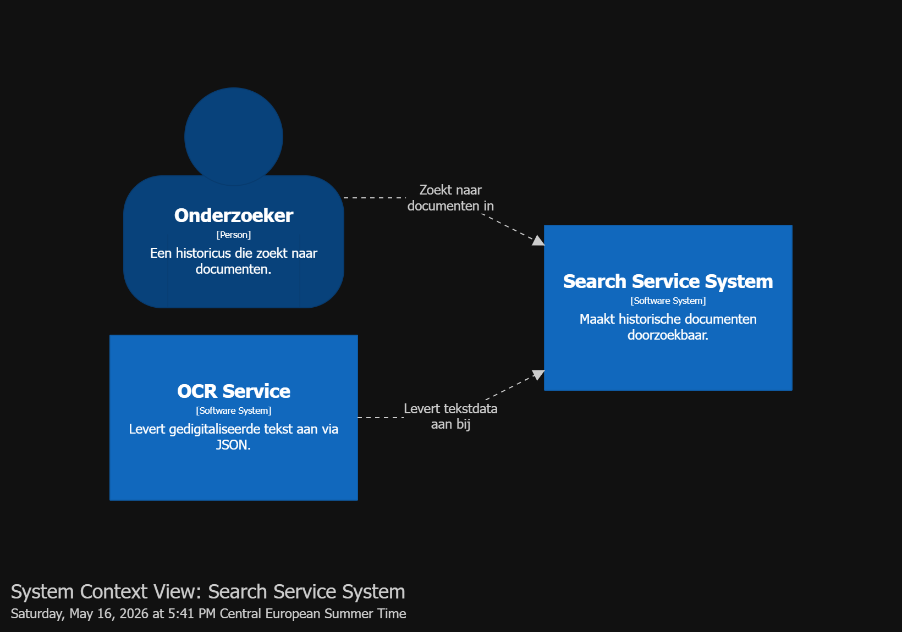
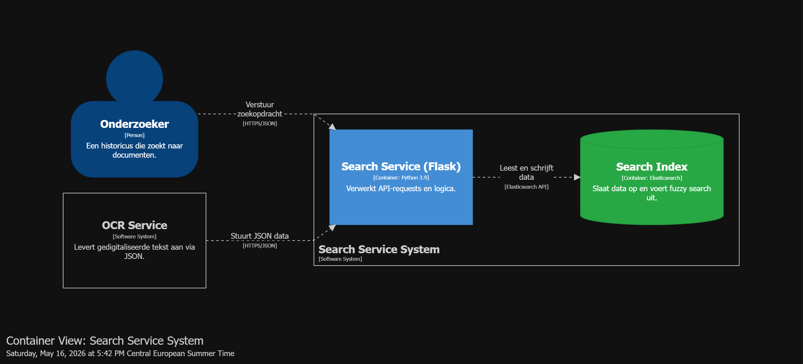
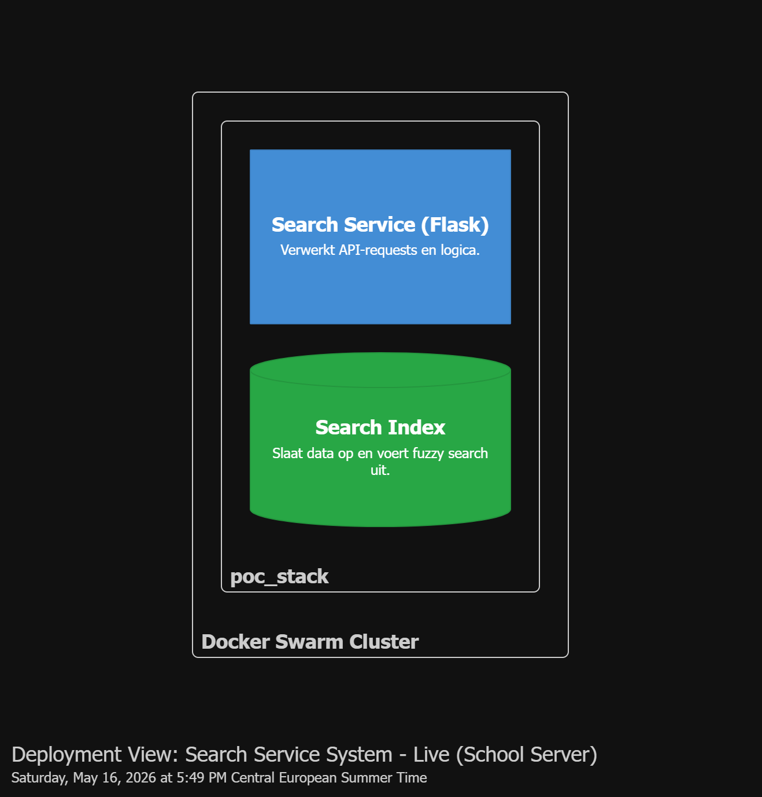

# Zoektechnologie voor de Search Component (Elasticsearch)

## Projectbeschrijving

Dit project is een Proof of Concept (POC) voor de ICT Architecture projectopdracht. Het toont hoe historische, gedigitaliseerde documenten efficiënt doorzoekbaar gemaakt kunnen worden via Elasticsearch.

Antieke documenten worden via OCR (Optical Character Recognition) ingelezen. Dit levert tekst op met herkenningsfouten en verouderde spellingen. De POC demonstreert dat Elasticsearch ook bij zulke tekst correct kan zoeken via fuzzy matching, waardoor gebruikers snel relevante documenten vinden ondanks spellingsvariaties.

De Proof of Concept staat in [poc/](poc/).

---

## Architectuuroverzicht

De architectuur bestaat uit twee containers die samenwerken:

```
Onderzoeker   -->  Search Controller                verstuurt zoekopdracht (HTTPS/JSON)
OCR Service   -->  Ingest Controller                levert gedigitaliseerde tekst (HTTPS/JSON)
Ingest Controller  -->  Elasticsearch Client        indexeert data
Search Controller  -->  Elasticsearch Client        voert zoekopdrachten uit
Elasticsearch Client  -->  Search Index (ES)        leest en schrijft data (Elasticsearch API)
```

---

## C4 Diagrammen

De onderstaande diagrammen zijn opgesteld volgens het **C4-model** en opgebouwd met **Structurizr DSL**. Het bronbestand staat in [c4-model/](c4-model/).

### Systeemcontextdiagram



### Containerdiagram



### Deploymentdiagram



### DSL broncode

Zie [c4-model/searchservice.dsl](c4-model/searchservice.dsl).

```structurizr
workspace "Search Service PoC" "Architectuuroverzicht van de Historische Zoekmachine" {

    model {
        # Niveau 1: Mensen en Externe Systemen
        onderzoeker = person "Onderzoeker" "Een historicus die zoekt naar documenten."
        ocrService = softwareSystem "OCR Service" "Levert gedigitaliseerde tekst aan via JSON."

        # Jouw Systeem
        searchSystem = softwareSystem "Search Service System" "Maakt historische documenten doorzoekbaar." {
            
            # Niveau 2: Containers
            searchApp = container "Search Service (Flask)" "Verwerkt API-requests en logica." "Python 3.9" {
                
                # Niveau 3: Componenten
                ingestController = component "Ingest Controller" "Handelt binnenkomende JSON data af." "Python/Flask"
                searchController = component "Search Controller" "Vertaalt zoekopdrachten naar ES queries." "Python/Flask"
                esClient = component "Elasticsearch Client" "Beheert de verbinding met de database." "Python Library"
            }

            searchIndex = container "Search Index" "Slaat data op en voert fuzzy search uit." "Elasticsearch" "Database"
        }

        # Relaties op Systeemniveau
        onderzoeker -> searchSystem "Zoekt naar documenten in"
        ocrService -> searchSystem "Levert tekstdata aan bij"

        # Relaties op Container/Component niveau
        onderzoeker -> searchController "Verstuur zoekopdracht" "HTTPS/JSON"
        ocrService -> ingestController "Stuurt JSON data" "HTTPS/JSON"
        ingestController -> esClient "Gebruikt voor indexering"
        searchController -> esClient "Gebruikt voor zoekopdrachten"
        esClient -> searchIndex "Leest en schrijft data" "Elasticsearch API"
    }

    views {
        # VIEW 1: SYSTEM CONTEXT
        systemContext searchSystem "SystemContext" {
            include *
            autoLayout lr
        }

        # VIEW 2: CONTAINER DIAGRAM
        container searchSystem "Containers" {
            include *
            autoLayout lr
        }

        # VIEW 3: COMPONENT DIAGRAM
        component searchApp "Components" {
            include *
            autoLayout lr
        }

        styles {
            element "Person" {
                shape Person
                background #08427b
                color #ffffff
            }
            element "Software System" {
                background #1168bd
                color #ffffff
            }
            element "Container" {
                background #438dd5
                color #ffffff
            }
            element "Component" {
                background #85bbf0
                color #000000
            }
            element "Database" {
                shape Cylinder
                background #28a745
                color #ffffff
            }
        }
    }
}
```

---

## Technologiestack

| Technologie    | Rol                                                                     |
|----------------|-------------------------------------------------------------------------|
| Python / Flask | Search Service API (Ingest Controller + Search Controller)              |
| Elasticsearch  | Gedistribueerde zoekindex met fuzzy search en inverted index            |
| Docker Swarm   | Orkestratie van containers via een stack                                |

---

## Mappenstructuur

```
sub-ADR-003/
├── README.md                              # Dit bestand (overzicht en ADR documentatie)
├── c4-model/
│   ├── searchservice.dsl                  # C4 model in Structurizr DSL
│   ├── system-context.png                 # Visueel systeemcontextdiagram
│   ├── container.png                      # Visueel containerdiagram
│   └── deployment.png                     # Visueel deploymentdiagram
└── poc/
    ├── app.py                             # Flask API met zoek- en ingestlogica
    ├── Dockerfile                         # Container definitie voor de Search Service
    ├── poc.yaml                           # Docker Swarm stack definitie
    ├── deploy.ps1                         # PowerShell deploy script
    ├── requirements.txt                   # Python dependencies
    ├── testdata.txt                       # Voorbeelddata voor de POC
    ├── .env.example                       # Voorbeeld omgevingsvariabelen
    ├── templates/
    │   └── index.html                     # Web interface voor de POC
    └── README.md                          # Opstartinstructies voor de POC
```

---

## POC

Alle instructies voor opstarten, testen en stoppen staan in [poc/README.md](poc/README.md).

---

## Documentatie

| Document | Beschrijving |
|---|---|
| [ADR-003](README.md) | Architectuurbeslissing: Elasticsearch als zoektechnologie |
| [C4 Architectuurdiagram (DSL)](c4-model/searchservice.dsl) | C4 model in Structurizr DSL (systeemcontext, container, component) |
| [Systeemcontextdiagram (PNG)](c4-model/system-context.png) | Visuele weergave van de systeemcontext |
| [Containerdiagram (PNG)](c4-model/container.png) | Visuele weergave van de containerarchitectuur |
| [Deploymentdiagram (PNG)](c4-model/deployment.png) | Visuele weergave van de deploymentarchitectuur |

### Kernbeslissing

**[ADR-003](README.md)** beschrijft de keuze voor Elasticsearch als zoektechnologie boven SQL-gebaseerde alternatieven. De voornaamste redenen zijn:

- **Searchability & Performance:** inverted index structuur zorgt voor zeer snelle zoekopdrachten over miljoenen documenten.
- **Fuzzy Search:** essentieel voor teksten met OCR-fouten en historische spellingsvariaties.
- **Horizontale schaalbaarheid:** nodes kunnen worden toegevoegd naarmate het archief groeit.

---

# ADR-003: Zoektechnologie voor de Search Component

> Dit ADR volgt het **Michael Nygard-formaat** (het originele ADR-formaat uit 2011).
> Referentie: <https://cognitect.com/blog/2011/11/15/documenting-architecture-decisions>

---

## Context

De klant (een onderzoeksafdeling geschiedenis) wil antieke documenten digitaliseren, archiveren en doorzoekbaar maken. Een van de belangrijkste drijvende karakteristieken voor ons systeem is **Searchability & Performance**.  
Antieke documenten worden vaak via OCR (Optical Character Recognition) ingelezen. Dit levert vaak tekst op met herkenningsfouten. Bovendien bevatten historische documenten verouderde spellingen en variaties op namen. Gebruikers moeten snel door miljoenen pagina's tekst kunnen zoeken.  
Een traditionele relationele database met SQL `LIKE '%zoekterm%'` queries schiet hier tekort: het vereist een full-table scan (wat zeer traag is bij grote datasets) en het biedt geen ondersteuning voor "fuzzy matching" (zoeken met typefouten) of relevantiescores (ranking).

---

## Beslissing

We kiezen voor **Elasticsearch** (een gedistribueerde, RESTful zoek- en analytics engine gebaseerd op Apache Lucene) als de dedicated zoekindex voor onze Search Component.  
De gedigitaliseerde teksten en metadata van de archiefstukken zullen vanuit de hoofd-database asynchroon (bijv. via een event bus of log-shipping) naar Elasticsearch worden gesynchroniseerd.

---

## Gevolgen

*   **Positief:**
    *   Zeer hoge zoekprestaties over miljoenen documenten dankzij de *inverted index* structuur.
    *   Ondersteuning voor *fuzzy search* (fouttolerantie), wat cruciaal is voor teksten met OCR-fouten en oude spellingen.
    *   Mogelijkheid om zoekresultaten te rangschikken op relevantie (scoring).
    *   Horizontaal schaalbaar: we kunnen nodes toevoegen naarmate het archief groeit.
*   **Negatief:**
    *   Verhoogde complexiteit: we moeten een extra component (het Elasticsearch cluster) beheren en monitoren.
    *   Data duplicatie: data leeft in de brondatabase én in de zoekindex. Er moet een mechanisme komen om deze data *eventually consistent* te houden (bijv. het bijwerken van de index als een document wordt aangepast).
