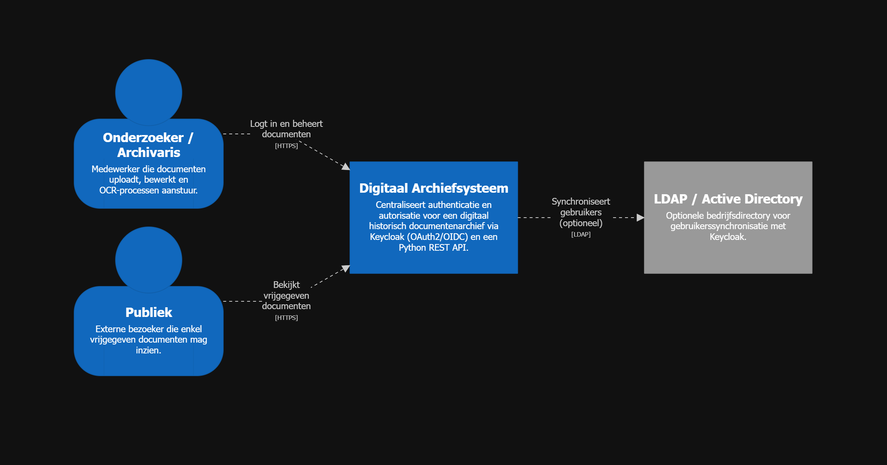
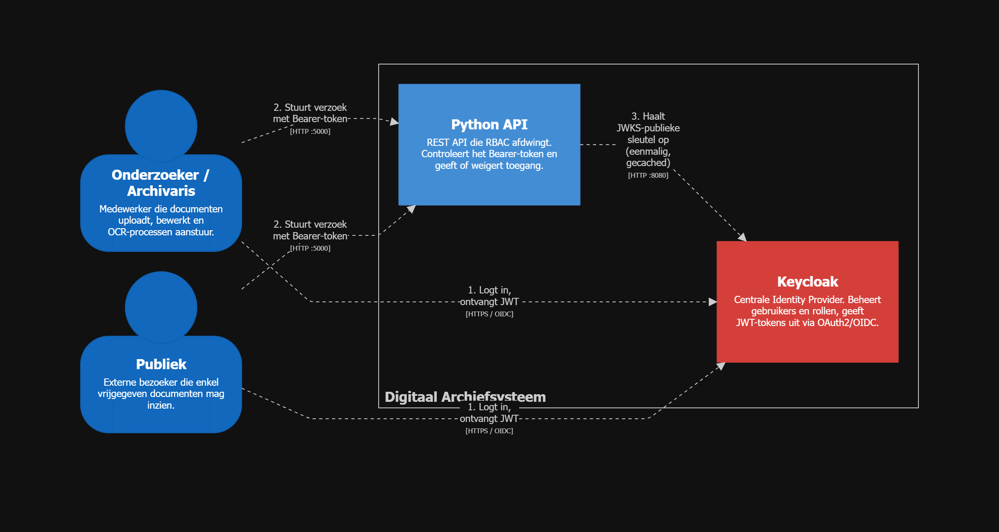
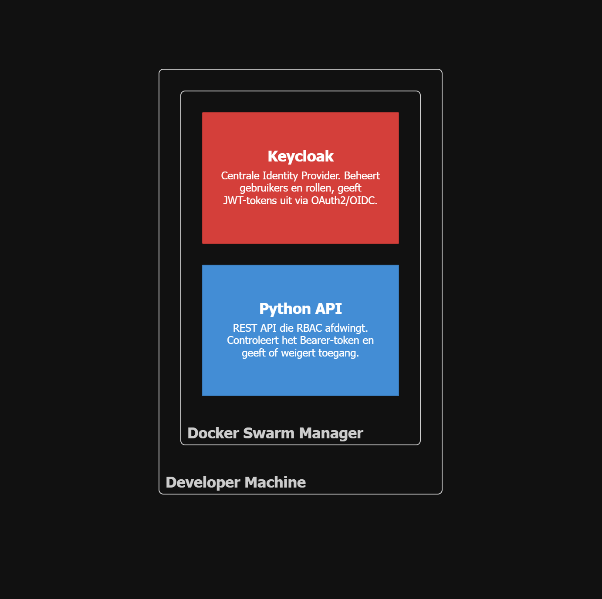

# Centraal Authenticatie- en Autorisatiebeheer

## Projectbeschrijving

Dit project is een Proof of Concept (POC) voor de ICT Architecture projectopdracht. Het toont een centraal authenticatie- en autorisatiesysteem voor een archiefsysteem van de onderzoeksafdeling geschiedenis, waarin gevoelige antieke documenten worden gedigitaliseerd.

De toegang is rolgebaseerd:

- **Onderzoekers / Archivarissen** kunnen documenten uploaden, bewerken en OCR-processen aansturen.
- **Het Publiek** mag enkel gevalideerde en vrijgegeven documenten inzien.

De POC demonstreert het architectuurpatroon uit [ADR-005](README.md): een centrale Identity Provider (**Keycloak**) die via OAuth2/OIDC communiceert met een Python API, waarbij Role-Based Access Control (RBAC) wordt afgedwongen.

---

## Architectuuroverzicht

De architectuur bestaat uit twee containers die samenwerken:

```
Gebruiker  -->  Keycloak (IdP)     logt in, ontvangt JWT
Gebruiker  -->  Python API         stuurt verzoek met JWT
Python API                         valideert JWT lokaal via gecachte JWKS-publieke sleutel van Keycloak
```

---

## C4 Diagrammen

De onderstaande diagrammen zijn opgesteld volgens het **C4-model** en opgebouwd met **Structurizr DSL**. De afzonderlijke bronbestanden staan in [c4-model/](c4-model/).

### Systeemcontextdiagram



```dsl
workspace {
    model {
        onderzoeker = person "Onderzoeker / Archivaris" "Medewerker die documenten uploadt, bewerkt en OCR-processen aanstuur."
        publiek     = person "Publiek" "Externe bezoeker die enkel vrijgegeven documenten mag inzien."

        archief = softwareSystem "Digitaal Archiefsysteem" "Centraliseert authenticatie en autorisatie voor een digitaal historisch documentenarchief via Keycloak (OAuth2/OIDC) en een Python REST API."

        ldap = softwareSystem "LDAP / Active Directory" "Optionele bedrijfsdirectory voor gebruikerssynchronisatie met Keycloak." "External"

        onderzoeker -> archief "Logt in en beheert documenten" "HTTPS"
        publiek     -> archief "Bekijkt vrijgegeven documenten" "HTTPS"
        archief     -> ldap    "Synchroniseert gebruikers (optioneel)" "LDAP"
    }

    views {
        systemContext archief "SystemContext" {
            include *
            autoLayout lr
        }

        styles {
            element "Element" {
                metadata    false
                description true
            }
            element "Person" {
                shape      Person
                background #1168bd
                color      #ffffff
            }
            element "Software System" {
                background #1168bd
                color      #ffffff
            }
            element "External" {
                background #999999
                color      #ffffff
            }
        }
    }
}
```

### Containerdiagram



```dsl
workspace {
    model {
        onderzoeker = person "Onderzoeker / Archivaris" "Medewerker die documenten uploadt, bewerkt en OCR-processen aanstuur."
        publiek     = person "Publiek" "Externe bezoeker die enkel vrijgegeven documenten mag inzien."

        archief = softwareSystem "Digitaal Archiefsysteem" {
            keycloak  = container "Keycloak" "Centrale Identity Provider. Beheert gebruikers en rollen, geeft JWT-tokens uit via OAuth2/OIDC." "Keycloak 26 · Docker" "Security"
            pythonApi = container "Python API" "REST API die RBAC afdwingt. Controleert het Bearer-token en geeft of weigert toegang." "Python 3 · Flask"
        }

        onderzoeker -> keycloak  "1. Logt in, ontvangt JWT" "HTTPS / OIDC"
        publiek     -> keycloak  "1. Logt in, ontvangt JWT" "HTTPS / OIDC"
        onderzoeker -> pythonApi "2. Stuurt verzoek met Bearer-token" "HTTP :5000"
        publiek     -> pythonApi "2. Stuurt verzoek met Bearer-token" "HTTP :5000"
        pythonApi   -> keycloak  "3. Haalt JWKS-publieke sleutel op (eenmalig, gecached)" "HTTP :8080"
    }

    views {
        container archief "Containers" {
            include *
            autoLayout lr
        }

        styles {
            element "Element" {
                metadata    false
                description true
            }
            element "Person" {
                shape      Person
                background #1168bd
                color      #ffffff
            }
            element "Container" {
                background #438dd5
                color      #ffffff
            }
            element "Security" {
                background #d43f3a
                color      #ffffff
            }
        }
    }
}
```

### Deployment diagram



```dsl
workspace {
    model {
        archief = softwareSystem "Digitaal Archiefsysteem" {
            keycloak  = container "Keycloak" "Centrale Identity Provider. Beheert gebruikers en rollen, geeft JWT-tokens uit via OAuth2/OIDC." "Keycloak 26 · Docker" "Security"
            pythonApi = container "Python API" "REST API die RBAC afdwingt. Controleert het Bearer-token en geeft of weigert toegang." "Python 3 · Flask"
        }

        deploymentEnvironment "Lokaal (Docker Swarm)" {
            developerMachine = deploymentNode "Developer Machine" "" "Windows 11 / macOS / Linux" {
                swarmManager = deploymentNode "Docker Swarm Manager" "" "Docker Engine (Swarm mode)" {
                    keycloakInstance = containerInstance keycloak
                    apiInstance      = containerInstance pythonApi
                }
            }
        }
    }

    views {
        deployment archief "Lokaal (Docker Swarm)" "Deployment" {
            include *
            autoLayout lr
        }

        styles {
            element "Element" {
                metadata    false
                description true
            }
            element "Container" {
                background #438dd5
                color      #ffffff
            }
            element "Security" {
                background #d43f3a
                color      #ffffff
            }
            element "Infrastructure Node" {
                background #ffffff
            }
        }
    }
}
```

---

## Technologiestack

| Technologie    | Rol                                                  |
|----------------|------------------------------------------------------|
| Python / Flask | REST API die RBAC afdwingt                           |
| Keycloak       | Identity Provider (OAuth2 / OIDC / RBAC)             |
| Docker Swarm   | Orkestratie van beide containers via een stack       |

---

## Mappenstructuur

```
sub-ADR-005/
├── README.md                              # Dit bestand (overzicht en ADR documentatie)
├── .env.example                           # Voorbeeld omgevingsvariabelen
├── c4-model/
│   ├── system-context.dsl                 # C4 systeemcontextdiagram (Structurizr DSL)
│   ├── system-context.png                 # Visueel systeemcontextdiagram
│   ├── container.dsl                      # C4 containerdiagram (Structurizr DSL)
│   ├── container.png                      # Visueel containerdiagram
│   ├── deployment.dsl                     # C4 deployment diagram (Structurizr DSL)
│   └── deployment.png                     # Visueel deployment diagram
└── poc/
    ├── app.py                             # Flask API met echte JWT-validatie via Keycloak JWKS
    ├── requirements.txt                   # Python dependencies (flask, PyJWT[crypto], requests)
    ├── Dockerfile                         # Alternatief voor lokale builds buiten Swarm
    ├── poc.yaml                           # Docker Swarm stack definitie
    ├── .env                               # Omgevingsvariabelen (niet in versiecontrole)
    ├── .env.example                       # Voorbeeld omgevingsvariabelen
    ├── keycloak/
    │   └── realm-export.json              # Automatisch geconfigureerde Keycloak-realm
    ├── public/
    │   └── index.html                     # Web interface voor de POC
    └── README.md                          # Opstartinstructies voor de POC
```

---

## POC

Alle instructies voor opstarten, testen en stoppen staan in [poc/README.md](poc/README.md).

---

## Documentatie

| Document | Beschrijving |
|---|---|
| [ADR-005](README.md) | Architectuurbeslissing: Keycloak als centrale IdP (MADR-formaat) |
| [Systeemcontextdiagram (DSL)](c4-model/system-context.dsl) | C4 systeemcontextdiagram in Structurizr DSL |
| [Systeemcontextdiagram (PNG)](c4-model/system-context.png) | Visuele weergave van de systeemcontext |
| [Containerdiagram (DSL)](c4-model/container.dsl) | C4 containerdiagram in Structurizr DSL |
| [Containerdiagram (PNG)](c4-model/container.png) | Visuele weergave van de containerarchitectuur |
| [Deploymentdiagram (DSL)](c4-model/deployment.dsl) | C4 deployment diagram in Structurizr DSL |
| [Deploymentdiagram (PNG)](c4-model/deployment.png) | Visuele weergave van de deploymentarchitectuur |

### Kernbeslissing

**[ADR-005](README.md)** beschrijft de keuze voor Keycloak als centrale Identity Provider boven een zelfgebouwde authenticatieservice. De voornaamste redenen zijn:

- **Security:** bewezen protocollen (JWT, OIDC) worden gebruikt in plaats van risicovolle eigen implementaties.
- **Extensibility:** nieuwe microservices integreren door simpelweg tokens te valideren tegen de centrale IdP.
- **Data Integrity:** strikte RBAC garandeert dat enkel geautoriseerde archivarissen documenten kunnen aanpassen of verwijderen.

---

# ADR-005: Centraal Beheer van Authenticatie en Autorisatie via Keycloak

> Dit ADR volgt het **MADR-formaat** (Markdown Architectural Decision Records, v3.0.0).
> Referentie: <https://adr.github.io/madr/>

**Status:** Accepted  
**Datum:** 2026-05-05  
---

## Context en Probleemstelling

De onderzoeksafdeling geschiedenis vereist een systeem voor de digitalisering van gevoelige antieke documenten. De toegangsrechten zijn niet uniform:

- **Onderzoekers / Archivarissen** moeten documenten kunnen uploaden, bewerken en OCR-processen aansturen.
- **Het Publiek** mag enkel gevalideerde en vrijgegeven documenten inzien.

De architectuur bestaat uit meerdere services (Document Service, OCR Service, …). Zonder centraal beheer zou elke service afzonderlijk gebruikers moeten valideren, wat leidt tot versnipperde securitylogica, een verhoogde kans op kwetsbaarheden en een gebrek aan audit trails.

**Beslissingsvraag:** Hoe beheren we authenticatie en autorisatie centraal over alle services heen?

---

## Overwogen Opties

1. Custom Authentication Service (zelfbouw)
2. **Keycloak**, open-source Identity Provider *(gekozen)*
3. Auth0 / Okta, cloud Identity-as-a-Service

---

## Beslissingsresultaat

**Gekozen optie: Keycloak**

Keycloak biedt de beste balans tussen security, controle over gevoelige data en uitbreidbaarheid voor een intern systeem met historische documenten.

### Positieve gevolgen

- Out-of-the-box ondersteuning voor RBAC, SSO en LDAP/AD-integratie
- Stateless authenticatie via JWT, services hoeven geen sessie-informatie op te slaan
- Bewezen protocollen (OAuth2, OIDC, RS256) minimaliseren securityrisico's
- Volledige controle over gebruikersdata (on-premise, geen vendor lock-in)
- Audit logging van alle inlogpogingen en rechtenwijzigingen ingebakken

### Negatieve gevolgen

- Extra operationele last: de Keycloak container moet beheerd en gemonitord worden
- In productie vereist high availability (redundante instanties nodig)
- Initiële configuratie (realm, clients, rollen) is tijdsintensief

---

## Vergelijking van Opties

### Optie 1: Custom Authentication Service

| | |
|---|---|
| **Voordeel** | Volledige controle over databaseschema's en flows |
| **Nadeel** | Extreem risicovol: wachtwoordhashing, MFA, "Forgot Password"-flows en sessiebeheer moeten veilig van nul worden opgebouwd. Vereist gespecialiseerde securityexpertise en past niet binnen de projecttijdlijn. |

### Optie 2: Keycloak ✓

| | |
|---|---|
| **Voordeel** | Out-of-the-box RBAC, SSO en LDAP/AD-integratie. On-premise, dus volledige controle over gevoelige gebruikersdata. Grote community en bewezen track record. |
| **Nadeel** | Extra operationele last voor beheer en monitoring van de Keycloak container. |

### Optie 3: Auth0 / Okta

| | |
|---|---|
| **Voordeel** | Minimale operationele last, automatisch schaalbaar |
| **Nadeel** | Gebruikersdata wordt opgeslagen bij een externe partij, problematisch voor een archief met gevoelige historische documenten. Bovendien aanzienlijke kosten bij schalen en afhankelijkheid van een externe SLA. |

---

## Rationale (link met driving characteristics)

De keuze voor Keycloak ondersteunt de kernkwaliteiten van het systeem:

- **Security:** bewezen protocollen (JWT, OIDC) in plaats van risicovolle eigen implementaties.
- **Extensibility:** nieuwe services integreren door simpelweg tokens te valideren tegen de centrale IdP, zonder aanpassingen aan de IdP zelf.
- **Data Integrity:** strikte RBAC garandeert dat enkel geautoriseerde archivarissen documenten kunnen aanpassen of verwijderen.
- **Auditability:** Keycloak logt alle inlogpogingen en rechtenwijzigingen, essentieel voor de historische betrouwbaarheid van het archief.

---

## Gevolgen

- **Architecturaal:** Stateless authenticatie via JWT. Services slaan geen sessie-informatie op.
- **Ontwikkeling:** Elke service moet middleware bevatten die de `Authorization`-header controleert en het token valideert tegen Keycloak.
- **Infrastructuur:** Keycloak moet in productie redundant worden uitgevoerd (minimaal twee instanties achter een load balancer).
